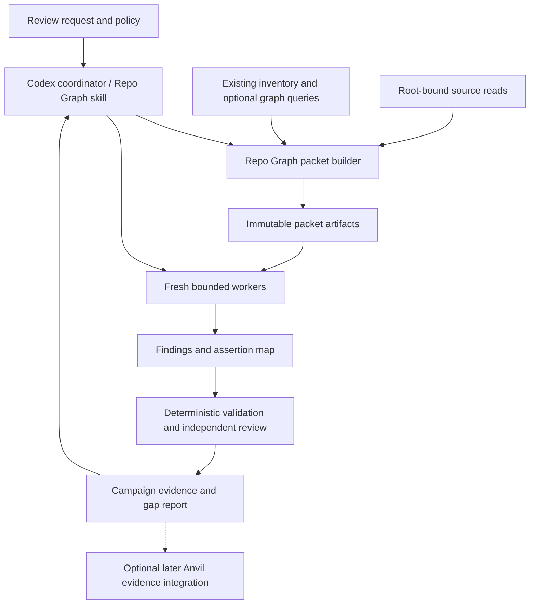

# Repo Graph bounded review for Codex

Status: execution authorized; Codex packet alpha in development, qualification
pending. Date: 2026-10-10.
Source inspected: `949db2f35a667ac877faebe81b887775e7937038` from refreshed
`origin/main`. Development implements the packet commands and installed
provider-free plumbing; delegated model reviews remain unqualified. See [the execution plan](review-workflow-execution.md) and
[ADR 0007](adr/0007-bounded-review-workflow.md).

## Outcome and first use

An operator requests a review of a large repository. Repo Graph produces
bounded source packets for fresh reviewers, records findings against the exact
source, exposes unread or uncertain areas, and resumes the work in a fresh
Codex session. The initial task profile identifies opportunities to simplify
Python tests while preserving distinct assertions and recovery behavior.

The review result answers: what can be combined, what must remain separate,
what source supports that decision, and what validation an implementation needs.
The number of source lines delivered is evidence of delivery, not comprehension.

## Selected scope and remaining decisions

The operator selected extending Repo Graph and focusing squarely on Codex.
The new workflow targets Codex only. Existing Claude Code and Pi map/search
entrypoints remain supported by their existing contracts; new review adapters
for them are outside this plan. Do not build an adapter framework for future
harnesses. Codex app and CLI are distinct execution surfaces: qualify the
surface actually used before claiming support for the other.

Execution follows the operator-approved read-only and quality-first plan.

| Decision | Proposed default | Alternative and effect |
| --- | --- | --- |
| Automation in the first release | Bounded read-only review batches after surface qualification | Packet preparation remains available when delegation is unqualified; implementing recommendations adds code ownership, execution and rollback scope |
| Anvil dependency | Defer optional integration; initial review records are explicitly standalone | Requiring Anvil moves the supported evidence link and authority checks into the first release |
| Optimization priority | Quality first within explicit context and cost budgets | Lowest cost favors fewer strong reviews; fastest completion favors more concurrent workers |

Additional assumptions: Python/pytest test consolidation is the first qualified
task profile, with same-host continuation across Codex sessions. Other languages,
remote transfer and automatic edits follow measured need. Optional Anvil
integration is a separate follow-on; it is not a first-release dependency.
The paid-pilot ceiling still needs an operator selection. These scope decisions
do not establish release qualification.

## Expanding Repo Graph's Codex use cases

Repo Graph supplies evidence and progress; Codex supplies reasoning and worker
lifecycle. Start with one tested review task, then reuse the packet and result
records only when another task demonstrates a need. No profile registry or
general workflow engine is required for the initial implementation.

| Use case | First useful result | Scope |
| --- | --- | --- |
| Test consolidation | Assertion map, redundant setup candidates, preserved recovery checks and validation plan | Initial qualified workflow |
| Change-impact review | Changed symbols, candidate affected callers/tests and explicit unresolved dependencies | Next candidate after the pilot; qualify with its own source-backed cases |
| Dead-code investigation | Candidate unused code, entrypoint/registration checks and deletion prerequisites | Later; missing static edges never prove code is dead |
| Journey understanding | Source/test anchors for a named user journey, with missing links visible | Later; session outcomes remain private evidence, separate from inferred code paths |

The initial implementation makes repeated, resumable review possible in Codex.
It does not implement the later profiles, automatically delete code, or certify
a production journey from source coverage alone.

## Existing capabilities and gaps

The current source contains experimental structural and function analysis.
The released 0.6.0 instructions still expose mapping and search; analysis has
separate outstanding scale, agent, human and installation qualification. This
workflow must not turn merged experimental source into a release claim.

| Existing seam | Reuse | Required new behavior |
| --- | --- | --- |
| `repo_graph/builder.py::repo_files` | Inventory and exclusion information | Campaign denominator accounts for requested files, exclusions and unknown counts, including files never admitted to analysis |
| `repo_graph/source.py::SourceRoot` | Root-bound reads, content hashing, change detection and atomic writes | Complete bounded file acquisition for packets, without executing repository code |
| `repo_graph/analysis_queries.py::Queries` | Bounded symbol/caller/callee queries with explicit uncertainty | Candidate relationships for packet selection; graph results do not establish complete dependencies |
| `repo_graph/search.py::captured_source` | Generation/range/digest affinity and bounded redacted excerpts | Excerpts remain partial evidence; they cannot be relabelled as complete-file review |
| `repo_graph/search.py::index_status` | Captured readiness and freshness | Campaign status keeps captured identity separate from a fresh source check |
| `repo_graph/cli.py` and `scripts/repo_graph.py` | One native command and packaged entrypoint | Add a small `review` command family |
| Shared skill and Codex manifest | Existing Codex installation and skill entrypoint | Codex review instructions and capability-aware delegation; other harness entrypoints retain existing behavior |
| `tests/harness_smoke.py` | Existing isolated Codex installation and provider-free smoke patterns | Installed Codex packet/result journey; worker execution needs separate qualification |

The mapping scanner's bounded file synopsis can omit later declarations. Query
cursors expire and belong to their original session. Neither synopsis text nor
an ephemeral cursor is a durable review packet.

`SourceRoot` fails closed without descriptor-relative no-symlink opens. Initial
secure packet execution targets supported Linux/macOS environments after native
tests. Windows must report unsupported capability until equivalent reads and
publication are qualified; do not substitute a weaker path check silently.

## Ownership and architecture



Repo Graph owns source selection, packet identity, evidence validation and the
gap report. Codex owns model invocation, session lifecycle, permissions
and actual usage reporting. The current selected provider remains authoritative;
a model profile is an explicit mapping, not permission to change providers.

If the later Anvil integration is configured, Anvil owns task dependencies,
claims and acceptance. Repo Graph
stores evidence references and observed synchronization state. It never writes
Anvil databases or creates a competing accepted-task ledger. Standalone mode
records local review decisions with an explicit `authority=standalone` label.
An unavailable configured Anvil connection does not silently select standalone.
The initial release accepts standalone authority only and refuses an Anvil-bound
request until that integration is qualified. Project rules requiring Anvil still
apply to development work; standalone review records do not waive them.

Start with a CLI and the existing shared skill, with an explicit Codex review
section. Use Codex native delegation for worker creation and result capture.
A background service, MCP server, new vector store,
generic scheduler and custom UI are deferred. The existing parser-worker queue
is for bounded analysis subprocesses; it is not an LLM worker scheduler.

## User workflow and proposed interface

The development source provides these commands; they are absent from published
0.6.0 and do not establish delegated-review qualification:

```text
repo-graph review plan . --profile test-consolidation
repo-graph review next CAMPAIGN
repo-graph review record CAMPAIGN --result RESULT.json
repo-graph review status CAMPAIGN
```

`plan` creates an inventory and initial bounded packets without model calls.
`next` returns a pending packet or a precise stop reason; the coordinator owns
assignment. `record` validates and idempotently records a worker or independent
review result. `status` prints bounded progress, gaps and evidence references.
Model usage and quality are evaluated separately from observed pilot receipts.
Large status output is paged and does not inline source or full worker logs.

A proposed invocation such as `$repo-graph review the tests in this area and
suggest safe consolidation` starts the bounded coordinator workflow in Codex
when that execution surface passes capability checks. This is a proposed skill
instruction, not a registered slash command or current runtime feature. Its
settings come from a validated, conventional `repo-graph-review.json` in an
explicitly enrolled project or user configuration. Common runs do not require
long prompts or environment-variable setup. Configuration contains data and
profile identifiers, never shell templates or credentials. Untrusted repository
configuration cannot increase permissions, enroll a provider or expand export.

## Packet construction

1. Capture requested scope, exclusion policy, tool version and source identity.
   A Git commit alone is insufficient for a dirty checkout. Use file digests
   and a deterministic scope manifest; keep Git revision knowledge separately.
2. Select one behavior or related assertion family. Start from a complete test
   file plus fixtures, relevant implementation and required callers. Existing
   graph edges are candidate evidence; unresolved edges remain explicit gaps.
3. Deduplicate overlapping source spans. Give each included dependency a
   reason, exact range and digest. Include setup, failure and teardown paths
   needed to interpret the selected positive tests.
4. Fit complete units within the profile. The alpha blocks oversized files and
   dependencies explicitly. Logical-unit splitting and integration packets still
   require implementation and checks before an oversized scope can complete.
   Never drop a dependency or cut an arbitrary prefix to make a complete claim.
5. Materialize the packet and provenance outside the source repository. Record
   redaction, clipping, unsupported syntax and omitted dependencies. Reviewers
   can request a follow-up packet; summaries do not replace required source.
6. Validate source digests immediately before dispatch and before accepting a
   result. A mismatch makes the relevant packet stale and schedules a new
   version. For unknown dependency reach, invalidate the broader source area.

The complete source scope is enumerated independently of graph admission.
Every requested eligible file is pending, delivered, reviewed, accepted,
excluded with reason, stale or blocked. Excluded/unsupported files stay visible
in the denominator report. A campaign cannot claim all requested code reviewed
while any portion is unknown or omitted. Planned exclusions are not deletions.

Before editing a file later, apply that repository's full-file reading rules.
A packet-level review alone does not certify an unread remainder of a large file.

## Context, work and cost budgets

Initial source-content targets are hypotheses to calibrate:

| Profile | Target source tokens | Split above | Intended use |
| --- | ---: | ---: | --- |
| Economy reviewer | 10,000–20,000 | 30,000 | Focused assertion and fixture review |
| Lead reviewer | 20,000–40,000 | 60,000 | Cross-file integration and disputed findings |
| Sensitive behavior | 5,000–15,000 | 20,000 | Concurrency, authorization, cancellation and recovery |

Bindings such as Terra or Astra belong in user configuration and must be
available through the selected harness/provider. These limits are not model
quality guarantees. A first pilot starts with two workers and one coordinator;
the independent review runs within the same total concurrency ceiling.

Where the adapter exposes all inputs, enforce:

`packet + instructions + tools + history + reserved output <= effective context`

Record tokenizer identity and counted text. If no compatible tokenizer or
hidden-context measurement is available, label the values estimated/unknown.
Use an explicit byte-bounded profile instead of claiming an exact token ceiling;
a strict token-budget request cannot be certified by a characters-per-token
guess. Never drop trusted instructions to make a packet fit. Fresh workers get
the task, applicable instructions and packet, without the coordinator transcript.
Use explicitly authorized model/role choices. Do not infer a cheaper model from
a profile name or change the parent session's provider settings.

Packet bytes, source-read bytes, query work, result bytes, packet count, worker
count and wall time each have finite bounds. Calibrate byte caps in the pilot
and publish them as versioned profile data. Over-budget work returns a split
or blocked reason. Reserve output and any reported reasoning allowance before
dispatch. Repeated source requests and follow-up packets count toward usage.

The operator sets a campaign ceiling before paid automated runs. Count the
coordinator, workers, independent reviewer, retries, failures and cached-input
charges. Record observed provider usage and dated prices when available;
unknown cost remains unknown. A strict dollar cap requires an adapter/provider
with a bounded reservation or spend control. Otherwise offer a bounded-request
pilot with an explicitly estimated cost; do not promise an enforceable dollar cap.

## Durable records and state transitions

Use one campaign directory in the existing local cache, outside source and
excluded from commits. Reuse guarded atomic publication. Start with immutable
JSON packet/result records and a small atomically replaced manifest, avoiding
a second service or event database. Only one coordinator writes campaign state;
workers return results and do not mutate the manifest. Concurrent coordinators
are rejected. Recovery never assumes a lock's age proves its owner is dead.

| Record | Minimum contract |
| --- | --- |
| Campaign | Schema version, campaign ID, repository binding, scope digest, exclusions, policy/profile digest, authority, budget, adapter capabilities and packet references |
| Packet | Content-derived packet ID/version, snapshot and file digests, exact byte/line ranges, intent, required dependencies, omissions, token/byte accounting and expected result contract |
| Assignment | Packet ID, unique attempt ID, worker/session identity, selected model/settings, start/end/stop state and usage availability |
| Result | Packet/attempt identity, reviewed ranges, findings with citations, assertion map, gaps, recommendation and usage references |
| Independent decision | Exact result digest, reviewer/model provenance, accepted/rejected/needs-source disposition and rationale |

Packet IDs exclude timestamps and local absolute paths. Source-root capabilities
remain local and are not fabricated from those IDs. A fresh Codex session on
the same host revalidates the same binding. Cross-machine transfer needs explicit
rebinding and full content verification and is deferred from the first release.

State sequence: `planned -> assigned -> result_received -> validated ->
reviewed`. Validation can instead yield `needs_source`, `invalid` or `stale`.
Independent review records `accepted` or `rejected` within the selected authority.
Cancellation, timeout and uncertain worker termination remain separate outcomes;
they are not completed reviews. An accepted result becomes stale if its source
basis changes. Prior records are retained as historical evidence.

Duplicate submission of the same result digest is idempotent. A different
result for the same attempt is a conflict; it cannot overwrite the first.
The later Anvil evidence integration must use a stable external reference and supported
readback. If delivery is uncertain, reconcile that reference before retrying.

The alpha labels completion `materialized_source_only` and always reports
`dependencies_complete=false`. A completed result requires full ranges for
every included file and every static primary-test assertion. An attributed
independent disposition does not prove dependency closure or authorize deletion.
Status checks source and result evidence only for its requested page; other
pages retain unknown current freshness. Earlier decisions remain historical
evidence when their basis becomes stale.

Track `materialized`, `returned_to_harness`, `reviewer_claimed_read` and
`independently_accepted` separately. Missing transport acknowledgement or
truncated tool output cannot become proof that all lines reached the worker.
The model cannot prove comprehension by checking a box.

## Test-consolidation result contract

Every candidate identifies original tests and collected parameter cases,
distinct behavior checks, fixture lifecycle costs and proposed destinations.
Its assertion map has one of four dispositions per original behavior:
`preserved`, `combined`, `duplicate_with_evidence`, or `unresolved`.

Recommend removal only when each original behavior has a justified destination
or a cited equivalence argument. Label confidence as reviewer judgment, not a
probability. Code execution overlap is a lead, not proof of assertion equivalence.
Coverage, collected cases, scenario checks, source LOC and duration remain
separate metrics. Logs may improve diagnosis but cannot replace assertions.

For the Anvil Serving pilot, keep the existing 70% coverage floor and scope,
compare with the measured baseline, and preserve journey-specific authorization,
isolation, cancellation, finalization and recovery behavior. Recommendations
include focused validation commands; executing tests is a separate explicit
validation step because importing a test suite executes repository code.

## Codex integration and capability levels

Keep the current `$repo-graph` skill and native installation. The skill directs
the Codex coordinator to the existing CLI plus the proposed review commands.
Native subagents receive bounded task packets and return structured findings.
Repo Graph does not invoke a separate model SDK, manage Codex accounts, install
provider credentials or recreate Codex's scheduler.

Record the actual app/CLI surface and version, fresh-session support, worker
lifecycle control, source-read permissions, model selection, usage visibility,
output limits and structured-result support. Unknown capability is not inferred
from a version. Start qualification with the current Codex working surface;
installation checks against a CLI do not establish app worker behavior.

1. **Packet workflow:** Codex prepares packets, performs an explicitly scoped
   review and records results. Native delegation is not required for this level.
2. **Delegated workflow:** a qualified Codex surface creates fresh read-only
   workers, records owned attempts, captures results and reconciles cancellation.
   Independent review follows without giving the author acceptance authority.
3. **Resume:** another Codex session loads the campaign, rechecks source and
   owned attempts, and continues only pending work. It needs no copied transcript.

An unsupported automatic request returns `unsupported_capability` with the
supported packet path; it never launches a more permissive process or
substitutes a model. The initial release implements one Codex integration;
different calling surfaces receive support only after their own checks pass.

Read-only means no source edits and no arbitrary source execution in reviewer
workers. Enforce it with harness restrictions where possible; validate any
remaining limits and report them explicitly. Worker output is treated as data,
not instructions to run commands. Do not change the user's main session/provider.

## Privacy, recovery and operational limits

Packets can contain private source. Retain them locally with restrictive file
permissions and a documented cleanup command/retention policy. Provider access
occurs only through the authorized harness and its existing credential resolver.
Exclude secrets, environment files and sensitive paths before selection; reuse
source redaction and mark omitted evidence. Do not export source to a new
reranker or provider as a side effect of review. Static filters are imperfect;
they do not justify a public-safe guarantee for arbitrary source.

Treat source comments and retrieved text as untrusted data. Policy and scope
come from the operator and trusted harness instructions. Result schemas reject
unknown authority-bearing fields, oversized text and invalid ranges/digests.

On cancellation, stop dispatch, request termination only for owned worker
sessions, await bounded cleanup, and retain partial evidence. Unknown termination
requires reconciliation before replacement dispatch. No automatic replay of an
uncertain paid request. Resume uses durable attempt IDs; expired graph cursors
are replaced by new bounded queries against the declared snapshot basis.

## Acceptance and research basis

The [execution plan](review-workflow-execution.md) defines offline contracts,
Codex integration checks and a frozen comparative pilot. Success requires fewer
tokens or lower cost without losing independently verified review quality.
No percentage of test removal is a success criterion by itself.

Primary references, checked 2026-10-10:

- [Anthropic context engineering](https://www.anthropic.com/engineering/effective-context-engineering-for-ai-agents): motivates selective context and separate worker sessions; establishes no exact safe token threshold for this workflow.
- [Chroma Context Rot study](https://www.trychroma.com/research/context-rot): motivates controlled comparisons that separate task difficulty from added context; it does not benchmark these current model profiles.
- [Codex subagents](https://learn.chatgpt.com/docs/agent-configuration/subagents): native delegation must be qualified on the exact Codex execution surface.
- [ADR 0001](adr/0001-canonical-product.md), [ADR 0002](adr/0002-native-harness-installation.md) and [ADR 0006](adr/0006-analysis-qualification.md): canonical ownership, native installation and separate qualification remain in force.
